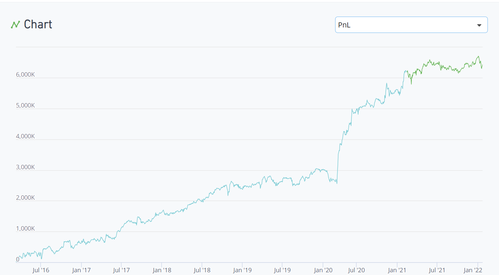
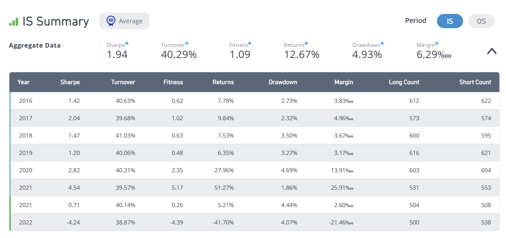

# WorldQuant alphas

## Terms

### Alpha testing parameters
---
```py title="Regions"
include United States (USA) and China (CHN)
```
```py title="Universe"
-- Subset of stocks ranked by liquidity. Smaller = more liquid
  * Includes TOP3000, TOP2000, TOP1000, TOP500, TOP200
```
```py title="Decay"
-- Linearly decays data over specified number of days. Helps smooth signal
```
```py title="Delay"
-- Data delay
  * Delay = 1 alphas trade in the morning using data from yesterday
  * Delay = 0 alphas trade in the evening using data from today
  * Delay 0 alphas perform better, so they have harder submission requirements
```
```py title="Truncation"
-- Maximum daily weight of each stock. Helps avoid over-weighting one company
```
```py title="Neutralization"
-- Adjust alpha weights to sum to zero within each group of the selected type
  * Includes Market, Sector, Industry, Subindustry, or Non
```
### Alpha performance metrics
---
```py title="Sharpe"
`Sharpe` -- Average measure of risk-adjusted returns
  * Sharpe = Avg. Annualized Returns / Annualized Std. Dev. of Returns
```
```py title="Turnover"
`Turnover` -- Average measure of daily trading activity
  * Turnover = Value Traded / Value Held
```
```py title="Fitness"
`Fitness` -- Hybrid metric for overall performance. Higher is better.
  * Fitness = Sharpe * Sqrt( Abs( Returns ) / Max( Turnover, 0.125 ) )
```
```py title="Returns"
`Returns` -- Annualized average gain or loss as a fraction of the invested amount.
  * Invested amount is equal to half the book size
```
```py title="Drawdown"
`Drawdown` -- Largest reduction in PnL during a given period, as a percentage.
```
```py title="Margin"
`Margin` -- Average gain or loss per dollar traded
  * PnL divided by total dollars traded in a given time period
```
### Operators
---
```py hl_lines="2"
Operators are building blocks
  * each one has a detailed explanation/math definition
  * add, subtract, mult, div -- be aware of units!
  * if/else, ternary
  * logical and, or, not
  * less/greater comparisons, eq/neq
```
```
Cross-sectional operators perform op across all stocks in universe at given point in time
  * rank, zscore, scale, sign
```
```
Time-series operators perform op on one stock across many points in time
  * tsdelta, tsdelay, tssum, tsmean, tsrank, tszscore, tsstddev, tsregression
```
```
Group operators are more powerful cross-sectional operators
  * Pick group like sector, industry, subindustry
```
```py hl_lines="3"
Time-series regression
  * tsregression(y, x, window, lag, retval) -- y(t) = a + b * x(t-lag) for t in past window days. Returns error, a, b, estimate. 
Cannot do cross-sectional correlation, only time-series correlation
```
```py hl_lines="2 3"
Tradewhen operator activates between entry and exit conditions
  * Reduces turnover
  * Useful for trading during high-volatility times
```
```
Humpdecay -- return today's or yesterday's price, depending if change exceeds hump value
  * Reduces turnover
```
```
Good values
  * Truncation value = 0.01 for diversity
  * Reversion threshold = 0.55 because research show 50% time reversion, 10% momentum, 40% random 
```
## Price-Volume alpha

### Ideas
---
```
Momentum / trend-following
  * Buy upward stocks, short downward stocks
```
```
Trend reversion
  * Short overbought stocks, buy cheap stocks
  * Useful in long-short frameworks
  * Works well during extreme price movements (overreaction)
    * Consider stddev to measure extreme price movements
    * Trade during times of high volatility
```
```
Try alpha `-(close - ts_mean(close, 5))`
  * Revert to weekly price, compared cross-sectionally
  * Uses absolute difference, so high prices are unfairly up-weighted
  * Long-short neutralization is performed to balance long and short positions
  * Wrap alpha with `rank` operator to get percentile? Helps with weighting
    * Good trick to improve diversity and performance
```
```
Reduce turnover = percent of portfolio traded per day ~ transaction costs!
  * Increase alpha decay
  * Combine operators
    * Also reduces correlation
```

### example

``` 
rank(ts_zscore(mdf_gry, 15))
```

**summary**

